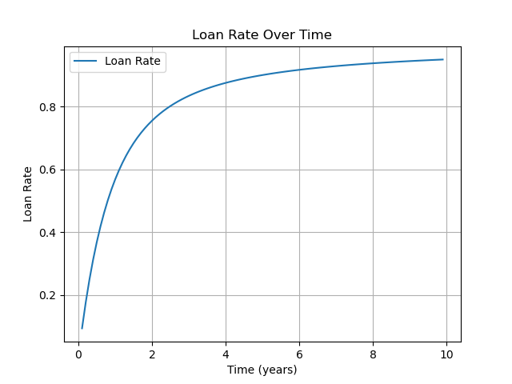

# Loan Interest Rate

## Interest Rate of Liquid Currency Discount

In [Storage and Loans](../1.规则/1.2.延伸规则.md#storage-loan), the **time discount effect** is mentioned—when a person issues a large amount of long-term currency, although they do not suffer direct loss, the liquid value decreases, causing market impact.

This loss can be simply viewed as the interest rate of the loan and can be mathematically calculated.

Using exponential distribution, suppose a person's breach risk rate is constant, and the probability that their currency is not breached until year $t$ is $S(t)=e^{-t/\lambda}$, where $\lambda$ is a scale parameter.

For currency exchanged at year $t$, suppose the original value is $dt$, its present value is $e^{-t/\lambda} dt$.

For all currency issued from now to year $T$, the present value is $\int_{0}^{T} e^{-t/\lambda} dt=\lambda-\lambda e^{-T/\lambda}$, and the original total value is $\int_{0}^{T} dt=T$. The loan interest rate is:

$$1-(\lambda - \lambda e^{-T/\lambda })/T=1-\lambda(1-e^{-T/\lambda})/T$$

When $\lambda=0.5$, the graph is as follows:

The graph shows that the interest rate is **cumulative**, rising with the risk rate $\frac{1}{\lambda}$, and the maximum is 100%. This is contrary to the marginal diminishing phenomenon of interest rates in modern society. There are two reasons for this phenomenon:

1. You cannot issue multiple currencies at the same time, so you cannot repeatedly issue short-term currency to seek low-interest loans, which provides the possibility for cumulative interest rates
2. The [total amount of time currency is limited](../2.优势.md#inflation); the further the currency is issued into the future, the rarer it becomes, and naturally has a higher value
3. The maximum loss from discount is 100% of the value, so the interest rate will not exceed 100%

## Interest Rate as Market Circulating Currency

Currency circulates in the market, becoming a tool for individuals or enterprises to obtain profits, while the issuer also bears the loss of liquid value. Therefore, currency taxation is a normal phenomenon under market equilibrium, and this tax rate can be regarded as the **risk-free interest rate**.

Thus, the beneficiaries of the risk-free interest rate shift from financial capitalists in capitalism to laborers in the time economy.
