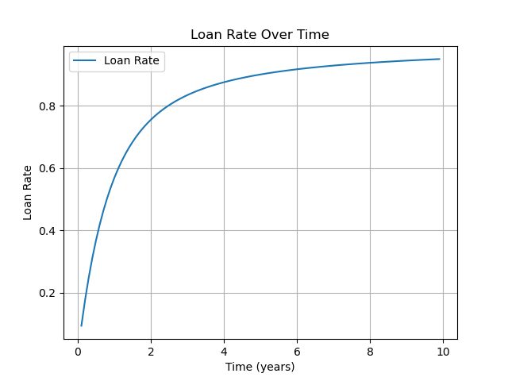

# 借贷利率

## 流通货币贬值的利率

在[存款与借贷](../1.规则/1.2.延伸规则.md#storage-loan)中提到了 **时间贬值效应** ——一个人签发大量远期的货币，虽然他不会受到直接损失，但也导致流通价值下降，损失市场影响力。

这种损失可简单地看作借贷的利率，可进行数学计算。

借助指数分布，假设个人违约风险率恒定，其货币直到t年还未违约的概率是$S(t)=e^{-t/\lambda}$次，其中$\lambda$是尺度参数。

对于$t$年到期兑换的货币，假设原价值为$dt$，其贴现的实际价值为$e^{-t/\lambda} dt$。

从当前到第T年的所有货币签发后，其实际价值为$\int_{0}^{T} e^{-t/\lambda} \mathrm{d}t=\lambda-\lambda e^{-T/\lambda}$，原有总价值为$\int_{0}^{T} \mathrm{d}t=T$，借贷利率为

$$1-(\lambda - \lambda e^{-T/\lambda })/T=1-\lambda(1-e^{-T/\lambda})/T$$

当$\lambda=0.5$时图如下所示：

上图表明，利率是 **累进** 的，随着风险率$\frac{1}{\lambda}$的上升而上升，且最高100%。这与现代社会中利率边际递减现象相反。造成这一现象的原因有两点：

1. 不能在同一时间发行多个货币，因而不能反复发行近期货币以谋求低息贷款，这为累进利率提供了可能
2. 时间货币[总量受限](../2.优势.md#inflation)，越远期的货币越往后发行，也就越稀有，自然有更高价值
3. 贬值最多损失100%的价值，因而利率不会超过100%

## 作为市场流通的货币利率

货币在市场中流通，成为个人或企业获取利润的工具，而货币发行人本身也承担了流通价值下降的损失，因此货币收税才是市场均衡下的正常现象，这种税率便可等价看作 **无风险利率** 。

由此，无风险利率的受益人从资本主义的金融资本变为了时间经济下的劳动者。
